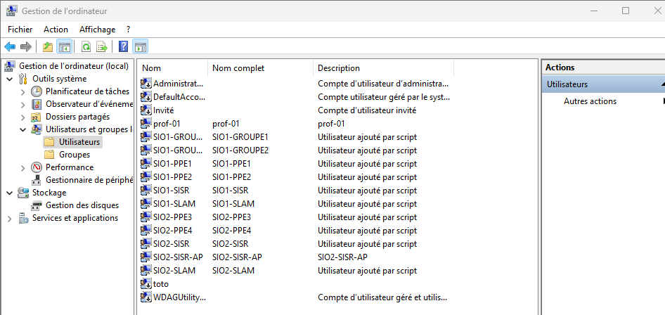
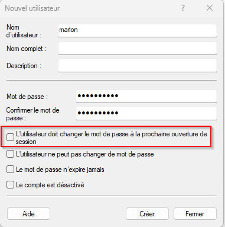
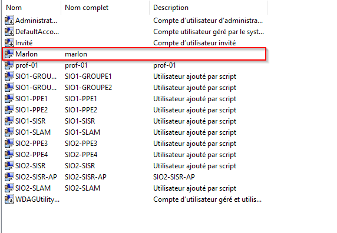
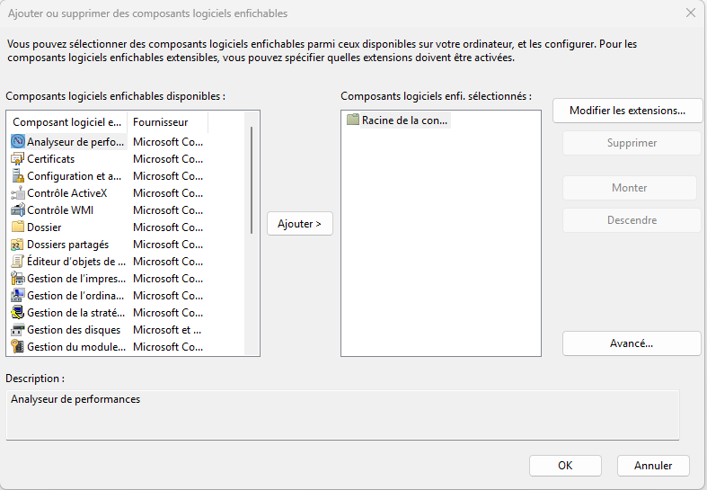

# 🛡️ Gestion des incidents & stratégie locale

---

## 📌 Mission 1 — Analyse CERT-FR

### ❓ Cibles des alertes récentes

* BIG-IP APM (F5)
* Messagerie instantanée
* Ivanti EPMM
* React Server Components
* Cisco SD-WAN

---

### ❓ Systèmes obsolètes

* SharePoint 2016 / 2019
* SonicWall
* Cisco ASA / FTD
* WSUS

---

### ❓ Détection d’une intrusion

* Logs (SIEM, antivirus, EDR)
* Fichiers disparus
* Services arrêtés
* Ralentissements système

---

### ❓ Réaction à une intrusion

```bash id="rj5c5v"
Isoler la machine
Couper le réseau
Sauvegarder les logs
```

---

## ⚙️ Mission 2 — Configuration Windows

---

## 👤 Création utilisateur

<p align="center">
  
</p>

<p align="center">
  
</p>

---

## 🖥️ Microsoft Management Console (MMC)

```bash id="e1p75w"
Windows + R
mmc.exe
```

<p align="center">
  
</p>

---

## 🔧 Ajout de composant

<p align="center">
  
</p>

---

## 🧩 Stratégie de groupe

<p align="center">
  
</p>

---

## 🔍 Sélection utilisateur

<p align="center">
  
</p>

---

## ⚙️ Script de connexion

```vbscript id="6lr24o"
MsgBox "Coucou, bienvenue sur mon domaine informatique !", vbInformation, "Bienvenue"
```

<p align="center">
  
</p>

---

# 🔒 Sécurisation du système

---

## 🚫 Blocage du panneau de configuration

<p align="center">
  
</p>

---

## 🖼️ Blocage du fond d’écran

<p align="center">
  
</p>

---

## 🔄 Windows Update

<p align="center">
  
</p>

```powershell id="y59p0r"
Get-WindowsUpdateLog
```

```powershell id="7s9w3h"
Get-ChildItem "C:\Windows\Logs\WindowsUpdate" | Sort-Object LastWriteTime -Descending
```

---

## 🧠 Étude du BOOT

* Analyse du gestionnaire de démarrage multi-OS

---

## 📁 Structure du projet

```bash id="cx6hyz"
StrategieLocalWindowsInstal/
│── README.md
│── images/
│   ├── image_1_1.png
│   ├── image_1_2.png
│   ├── image_2_1.png
│   ├── image_3_1.png
│   ├── image_4_1.png
│   ├── image_5_1.png
│   ├── image_6_1.png
│   ├── image_7_1.png
│   ├── image_8_1.png
│   ├── image_9_1.png
```

---

## ✅ Conclusion

* Détection rapide des incidents
* Mise en place de stratégies locales
* Importance des mises à jour et de la supervision

---

## 🚀 Déploiement

```bash id="hgtp1x"
git add .
git commit -m "final README with images"
git push
```

---
